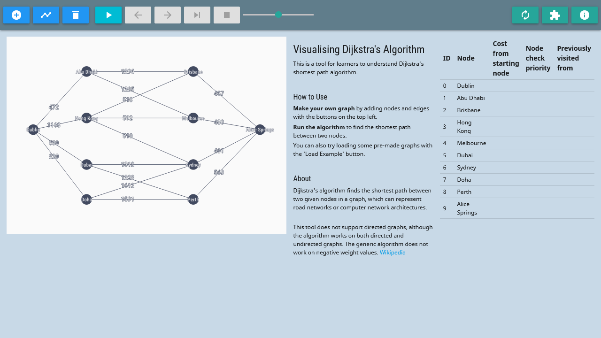

# Visualisation of Dijkstra's Shortest Path Algorithm  

## What is this?
The application is a tool to help students visualise how Dijkstra's algorithm runs.

Dijkstra's algorithm finds the shortest path between two points in a network, and variants of it are used widely in maps, internet networking, finding cheapest costs of a flight, etc. See [the Wikipedia article](https://en.wikipedia.org/wiki/Dijkstra%27s_algorithm) for more information.

This application lets you:
- Create your own graph networks
- Calculate the best (lowest cost) path between two points in the network
- Watch the algorithm work it out step-by-step, with explanations

[Try it out here](https://tanxh33.github.io/visualise-dijkstra/).

